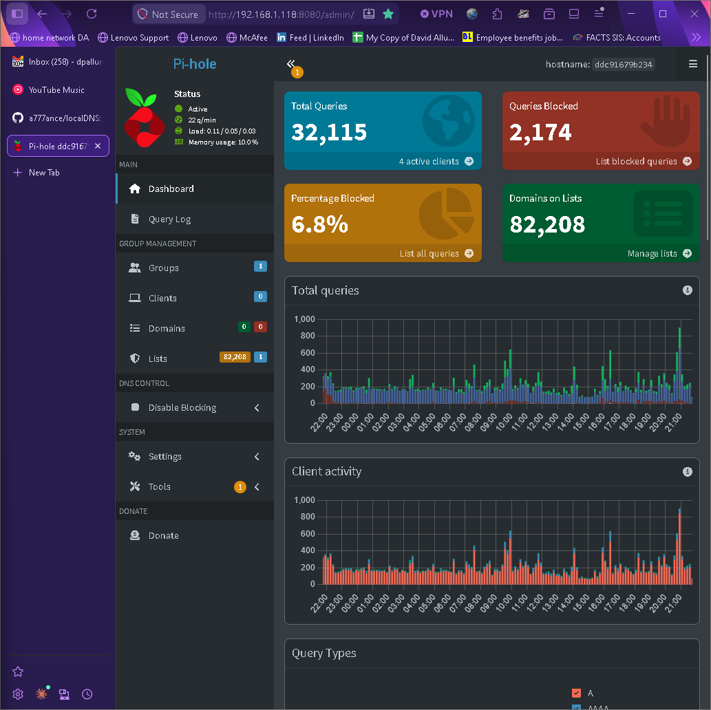

# localDNS

Self-hosted DNS, VPN, and network monitoring stack on an HP t630 thin client.
Every device on the home LAN — and every phone tunneled back over the self-hosted
WireGuard VPN — resolves DNS through Pi-hole (ad blocking) → Unbound (DNSSEC,
Cloudflare DoT for streaming). The tunnel, not physical location, defines what counts
as "inside" the network.

This repo is the config snapshot, rollback target, and complete reproduction
guide. Clone it to the t630 and follow Setup below to go from fresh
Ubuntu 24.04 to a fully running stack. Edits here do not take effect until
manually deployed — **the live t630 is the source of truth.**

For the surrounding network — router, ISP, and the rationale behind these design
choices — see **[network-context.md](network-context.md)**.

For fresh-install gotchas, break points, and workarounds discovered during setup — see
**[INSTALL-NOTES.md](INSTALL-NOTES.md)**.

---

## Thesis

This stack delivers measurable, verifiable outcomes from a single low-power node:

- **DNSSEC validation works** — signed zones return the `ad` flag, so tampered
  responses are rejected rather than trusted.
- **The privacy/speed split does what it claims** — `unbound-control lookup` proves
  streaming domains forward to Cloudflare over TLS while everything else (banking,
  email, health) resolves recursively and is *never* forwarded to a third party.
- **Ad and tracker blocking is network-wide** — every device benefits with no
  client-side software, and blocked domains are answered with `0.0.0.0`.
- **VPN peers get the full stack on cellular** — identical ad-blocking and DNSSEC over
  the WireGuard tunnel, with the t630 as the only DNS address peers need.
- **Bufferbloat is gone** — loaded latency under upload dropped from ~400–800 ms to
  ~11 ms (14 ms idle), measured on Spectrum ~200/100 Mbps.
- **The whole system is reproducible and reversible** — clean Ubuntu 24.04 to a fully
  running stack by following Section A, and every file maps to a documented deploy
  path for rollback.

**What it is not.** This is a single-node home stack, not a high-availability
deployment. The router's secondary DNS (`1.1.1.1`) is the only redundancy — it keeps
the network online if the t630 goes down, at the cost of ad-blocking until it
recovers. A few items remain open (see [Known issues](#known-issues)): the Windows
laptop key should be rotated, and WireGuard peers `10.8.0.4`–`10.8.0.6` need to be
identified or removed.

**The takeaway.** A ~$50 used thin client drawing ~10 W replaces a stack of cloud
DNS, VPN, and monitoring services — while keeping the query log those services would
otherwise collect on hardware you physically control, and proving the privacy
boundary holds with a single command.

---

## Operational notes

- Pi-hole blocklists update weekly via cron inside the container
- Unbound cache persists hourly and restores at boot automatically
- Pi-hole data backup: `docker run --rm -v pihole_data:/data busybox tar czf - /data > pihole-backup.tar.gz`
- Uptime Kuma data: back up `~/uptime-kuma/data/` directly
- Refresh root hints: `sudo curl -o /var/lib/unbound/root.hints https://www.internic.net/domain/named.root && sudo systemctl restart unbound`
- Reset firewall rules: `sudo bash 04-ufw/setup.sh` (idempotent — safe to re-run)
- Add a streaming domain to Cloudflare DoT: append a `forward-zone:` block to `01-unbound/streaming-forward.conf`, deploy to `/etc/unbound/unbound.conf.d/`, and `sudo systemctl restart unbound`. Never add sensitive domains.
- Add a WireGuard peer: see `05-wireguard/peer-template.conf`. Next free IP starts at `10.8.0.8`. Use `sudo systemctl reload wg-quick@wg0` — no restart needed.
- SSH to the t630: `ssh <user>@192.168.1.118` from the LAN, or `ssh <user>@10.8.0.1` (the tunnel address) from a connected WireGuard peer once Step 7 is up — port 22 is open to both `192.168.0.0/16` and `10.8.0.0/24` in `04-ufw/setup.sh`.

---

## Contents

- [0. Introduction](#0-introduction)
- [A. Setup (Quick-Start)](#a-setup-quick-start)
  - [Which steps do you need?](#which-steps-do-you-need)
  - [Before you begin](#before-you-begin)
  - [Step 0: Router — DHCP reservation](#step-0-router--dhcp-reservation)
  - [Step 1: CAKE SQM](#step-1-cake-sqm)
  - [Step 2: Unbound — Recursive DNS](#step-2-unbound--recursive-dns)
  - [Step 3: Docker CE](#step-3-docker-ce)
  - [Steps 4 + 5: Host DNS Fix, then Pi-hole](#steps-4--5-host-dns-fix-then-pi-hole)
  - [Step 6: UFW Firewall](#step-6-ufw-firewall)
  - [Step 7: VPN](#step-7-vpn)
  - [Step 8: Uptime Kuma](#step-8-uptime-kuma)
  - [Step 9: GPU Performance](#step-9-gpu-performance)
  - [Step 10: Remote Desktop](#step-10-remote-desktop)
  - [Step 11: Point LAN Clients at t630](#step-11-point-lan-clients-at-t630)
- [B. Detailed Specs / Network context](#b-detailed-specs--network-context)
  - [Hardware](#hardware)
  - [Network topology](#network-topology)
  - [Repository layout](#repository-layout)
- [C. How it works / FAQ / Troubleshooting](#c-how-it-works--faq--troubleshooting)
  - [DNS resolution chain](#dns-resolution-chain)
  - [Why Unbound runs on the host, not in Docker](#why-unbound-runs-on-the-host-not-in-docker)
  - [Why the host resolves its own DNS through external servers](#why-the-host-resolves-its-own-dns-through-external-servers)
  - [Unbound config files](#unbound-config-files)
  - [AMD Carrizo GPU](#amd-carrizo-gpu)
- [1. References](#1-references)
  - [Verification checklist](#verification-checklist)
  - [Configuration reference](#configuration-reference)
  - [Known issues](#known-issues)
  - [Further reading](#further-reading)

---

## 0. Introduction

**The philosophy.** DNS is the most complete log of your online life — every site,
app, and device you touch starts with a name lookup. This stack is built on the
premise that you should own that log, not rent it from whoever runs your resolver.
Two rules follow from that: privacy is the default, and speed is traded for it only
where the trade costs no privacy. The WireGuard tunnel — not your physical location —
defines what counts as "inside" the network. And the whole thing is
infrastructure-as-config: every file in this repo maps to an exact path on the box,
so the system is reproducible and reversible, not a pile of undocumented tweaks.

**The sales pitch.** One small, silent, always-on box gives the entire household:

- **Network-wide ad and tracker blocking** (Pi-hole) — every device, no per-client app
- **DNSSEC-validated recursive resolution** (Unbound) — banking, email, and health
  lookups are resolved by you, talking directly to the authoritative nameservers,
  and are never handed to a third-party resolver
- **Encrypted streaming lookups** (Cloudflare DoT) — speed for Netflix / YouTube /
  Spotify without leaking those lookups to the ISP in cleartext
- **Home VPN from anywhere** (WireGuard) — full ad-blocking and DNSSEC on cellular,
  exactly as if you were sitting at home
- **Bufferbloat eliminated** (CAKE) — loaded latency drops from ~400–800 ms to ~11 ms
- **Full monitoring** (Uptime Kuma) — you find out something broke before the
  household does

**The cost.** A used HP t630 thin client runs about $30–70 on the secondhand market
and draws roughly 10 W idle — a few dollars a year in electricity. Every component in
the stack is open-source: no subscriptions, no per-seat fees, no cloud bill. The real
cost is time — an afternoon to build it the first time, plus occasional maintenance.
Blocklist and cache upkeep are automated; key rotation and package upgrades are manual.

**The appeal.** Privacy you can actually verify (`unbound-control lookup` shows you
exactly which queries leave the box and which don't), control over your own
infrastructure, dramatically lower latency under load, and a genuinely educational
build that touches DNS, TLS, VPN, firewalling, QoS, containers, and systemd. It also
fails gracefully: if the t630 goes down, the router's secondary DNS keeps the network
online — you lose ad-blocking until it recovers, not connectivity — so the convenience
never hardens into a single point of failure.

---

## A. Setup (Quick-Start)

### Which steps do you need?

Not every step applies to every household. The DNS stack is the whole point of the
box; the rest is optional and depends on what you want — not on how many computers you
own. Phones benefit from network-wide ad-blocking and private DNS exactly like any
other device, so a phone-only home still wants the core stack.

| If you want… | Steps | Notes |
| ------------ | ----- | ----- |
| **Network-wide ad-blocking + private DNS** (the core reason to build this) | 0, 2, 3–5, 6, 11 | Required. Every device on the Wi-Fi benefits automatically once Step 11 points the router at the t630. |
| **Home DNS + LAN access from cellular** | + 7 (VPN) | Self-hosted WireGuard tunnel. (Cloudflare WARP is *not* a substitute — it routes DNS to Cloudflare, bypassing this stack; see Step 7.) |
| **Bufferbloat control for VPN traffic** | + 1 (CAKE) | Only shapes traffic the t630 forwards — i.e. Step 7 VPN clients. Skip it if you don't run the VPN. |
| **Monitoring / alerting** | + 8 (Uptime Kuma) | Optional dashboard. |
| **Graphical remote desktop *on the t630*** | + 9–10 (GPU + Remote Desktop) | Skip if you administer the box over SSH only — a phone-only or headless setup never needs these. |

Steps **9 and 10** are the ones to skip for a phone-only or headless household. The
DNS stack (Pi-hole + Unbound) is **not** — phones are a prime beneficiary of it.

---

### Before you begin

**Connect to the t630 over SSH.** Every command below runs on the t630 itself. From
any machine on the LAN:

```bash
ssh <user>@192.168.1.118        # the DHCP-reserved LAN address from Step 0
```

(Once WireGuard is up in Step 7 you can also reach it over the tunnel at
`ssh <user>@10.8.0.1` — see [Operational notes](#operational-notes).)

**Clone the repo to the t630.** All commands below use paths relative to the repo
root. Without this, every `cp` command fails immediately.

```bash
git clone https://github.com/a777ance/localdns ~/localdns
cd ~/localdns
```

---

### Step 0: Router — DHCP reservation

Do this **before** touching the t630 so it boots with a stable address from the start.

Find the t630's MAC address:
```bash
ip link show enp1s0   # MAC is the link/ether value
```

On the Netgear R7000: Advanced → Setup → LAN Setup → Address Reservation. Reserve
`192.168.1.118` for the t630's MAC.

Do **not** set the router's DNS to `192.168.1.118` yet. That happens in Step 11,
after the full stack is verified. Setting it now breaks name resolution for every
LAN device before Pi-hole is ready.

---

### Step 1: CAKE SQM

CAKE eliminates upload bufferbloat. Without it, latency spikes 400–800 ms under VPN
upload load. With it: 11 ms loaded vs 14 ms idle (measured on Spectrum ~200/100 Mbps).

**Scope:** shapes `enp1s0` egress — all traffic the t630 forwards toward the router.
Covers upload bufferbloat for WireGuard VPN clients. Does not address download
bufferbloat for general LAN devices (the Netgear R7000 is the correct fix point
for that; DD-WRT/FreshTomato both support CAKE).

**Files — [`06-cake/`](06-cake/):**
- [`setup.sh`](06-cake/setup.sh) — CAKE setup script; set `UPLOAD_MBPS` before deploying
- [`cake.service`](06-cake/cake.service) — systemd service

#### Install

```bash
# iproute2 (tc) is already present on Ubuntu 24.04
sudo cp 06-cake/setup.sh /usr/local/sbin/cake-setup.sh
sudo chmod 755 /usr/local/sbin/cake-setup.sh
sudo cp 06-cake/cake.service /etc/systemd/system/
sudo systemctl daemon-reload
sudo systemctl enable --now cake
```

#### Tune bandwidth cap

Open `06-cake/setup.sh` and adjust `UPLOAD_MBPS` to 90% of your measured ISP upload
**before** deploying. Current value: `85` (90% of ~94 Mbps on Spectrum). Keep it
below the ISP ceiling so CAKE's queue fills before the modem's unmanaged FIFO.

#### DNS priority marking

`cake-setup.sh` marks DNS response packets (source port 53, UDP and TCP) with DSCP
EF. CAKE's `diffserv4` scheduler places them in the highest-priority tin — DNS answers
skip bulk traffic so every new connection resolves before its first byte is queued.

#### Verify

```bash
systemctl status cake
tc qdisc show dev enp1s0                                       # → cake bandwidth 85Mbit
sudo iptables -t mangle -L POSTROUTING -v | grep DSCP         # → two rules, sport 53 → EF
watch -n1 tc -s qdisc show dev enp1s0                         # live queue stats
```

---

### Step 2: Unbound — Recursive DNS

Unbound runs on the host OS, not in a container. It is the DNS decision point — all
queries that pass Pi-hole's blocklist come here. It must exist before Pi-hole.

**Files — [`01-unbound/`](01-unbound/):**
- [`server.conf`](01-unbound/server.conf) — interface, port, access-control, security flags
- [`tuning.conf`](01-unbound/tuning.conf) — cache sizes, TTLs, threading (single source of truth for performance)
- [`streaming-forward.conf`](01-unbound/streaming-forward.conf) — streaming domains → Cloudflare DoT; all else recursive
- [`remote-control.conf`](01-unbound/remote-control.conf) — Unix socket for `unbound-control`
- [`root-auto-trust-anchor-file.conf`](01-unbound/root-auto-trust-anchor-file.conf) — DNSSEC root trust anchor
- [`unbound-cache-dump`](01-unbound/unbound-cache-dump) / [`unbound-cache-load`](01-unbound/unbound-cache-load) — cache persistence scripts (dump hourly + on stop; restore 2 s after start)
- [`unbound-cache-dump.service`](01-unbound/unbound-cache-dump.service) / [`unbound-cache-dump.timer`](01-unbound/unbound-cache-dump.timer) — systemd units for hourly cache dump
- [`unbound.service.d/override.conf`](01-unbound/unbound.service.d/override.conf) — service override (triggers cache restore on start)

#### Install

```bash
sudo apt update && sudo apt upgrade -y
sudo apt install -y unbound ca-certificates
```

#### Root hints and DNSSEC anchor

```bash
sudo curl -o /var/lib/unbound/root.hints https://www.internic.net/domain/named.root
sudo unbound-anchor -a /var/lib/unbound/root.key
sudo chown unbound:unbound /var/lib/unbound/root.key
```

#### Deploy configuration

```bash
sudo cp 01-unbound/*.conf /etc/unbound/unbound.conf.d/
sudo unbound-checkconf
sudo systemctl enable --now unbound
```

Five drop-ins deploy together. `unbound-checkconf` must pass before the next command.

#### Verify

```bash
dig @127.0.0.1 -p 5335 example.com +dnssec | grep "ad;"
# 'ad' flag = DNSSEC validation working

sudo unbound-control lookup netflix.com   # → forwarding request to 1.1.1.1@853 / 1.0.0.1@853
sudo unbound-control lookup chase.com    # → iterative delegation (recursive, private)
```

#### Step 2a: Encrypted streaming forward-path (Cloudflare DoT)

Already deployed by the `cp` above. `streaming-forward.conf` forwards streaming and
media domains to Cloudflare over DNS-over-TLS at port 853. Everything not listed
resolves recursively — Cloudflare never sees those queries.

Confirm end-to-end:
```bash
dig @127.0.0.1 -p 5335 netflix.com +short    # resolves → DoT path works
sudo unbound-control lookup chase.com        # iterative delegation → private recursive path
```

**Invariant:** never add sensitive domains (banking, email, health) to
`streaming-forward.conf` — that hands Cloudflare your private lookups.

#### Step 2b: Cache persistence

Cache dumps hourly and on Unbound stop; restores 2 seconds after start (socket settle
time). Warm cache survives reboots.

```bash
sudo cp 01-unbound/unbound-cache-dump 01-unbound/unbound-cache-load /usr/local/bin/
sudo chmod +x /usr/local/bin/unbound-cache-dump /usr/local/bin/unbound-cache-load
sudo mkdir -p /var/lib/unbound/cache
sudo mkdir -p /etc/systemd/system/unbound.service.d
sudo cp 01-unbound/unbound.service.d/override.conf /etc/systemd/system/unbound.service.d/
sudo cp 01-unbound/unbound-cache-dump.timer \
        01-unbound/unbound-cache-dump.service /etc/systemd/system/
sudo systemctl daemon-reload
sudo systemctl enable --now unbound-cache-dump.timer
```

---

### Step 3: Docker CE

Install from the official Docker repository, not Ubuntu's `docker.io` package.

```bash
sudo apt-get install -y ca-certificates curl
sudo install -m 0755 -d /etc/apt/keyrings
sudo curl -fsSL https://download.docker.com/linux/ubuntu/gpg \
  -o /etc/apt/keyrings/docker.asc
sudo chmod a+r /etc/apt/keyrings/docker.asc
echo "deb [arch=$(dpkg --print-architecture) signed-by=/etc/apt/keyrings/docker.asc] \
  https://download.docker.com/linux/ubuntu \
  $(. /etc/os-release && echo "$VERSION_CODENAME") stable" \
  | sudo tee /etc/apt/sources.list.d/docker.list > /dev/null
sudo apt-get update
sudo apt-get install -y docker-ce docker-ce-cli containerd.io \
  docker-buildx-plugin docker-compose-plugin
sudo systemctl enable --now docker
sudo usermod -aG docker $USER
```

**Log out and back in** (or `exec su -l $USER` in the same shell) before the next
step — the `docker` group change is not active in the current session. Running
`docker compose` without this produces a "permission denied on socket" error.

---

### Steps 4 + 5: Host DNS Fix, then Pi-hole

**Run these back-to-back. The host DNS fix comes FIRST — do it before starting Pi-hole.**

Pi-hole runs `network_mode: host`, so it wants to bind `0.0.0.0:53` on every
interface. That collides with systemd-resolved's stub listener on `127.0.0.53:53`:
on a fresh box Pi-hole cannot bind `:53` until the stub is turned off. The fix is to
free `:53` *first* (disable the stub) while simultaneously re-pointing the host's own
resolution at external resolvers, so the host never loses DNS and `:53` is clear when
Pi-hole launches. Doing it in this order avoids the "Temporary failure in name
resolution" window entirely.

#### Part A (do first): free port 53 and decouple host DNS — `03-host-dns/`

`03-host-dns/host-dns.conf` sets `DNS=9.9.9.9 1.1.1.1` **and** `DNSStubListener=no`.
Disabling the stub frees `:53`; because that also removes the `127.0.0.53` listener,
`/etc/resolv.conf` must be re-pointed off the stub file to the one that lists the
real upstreams.

**Files — [`03-host-dns/`](03-host-dns/):**
- [`host-dns.conf`](03-host-dns/host-dns.conf) — sets `DNS=9.9.9.9 1.1.1.1` and `DNSStubListener=no`

```bash
cd ~/localdns
sudo mkdir -p /etc/systemd/resolved.conf.d
sudo cp 03-host-dns/host-dns.conf /etc/systemd/resolved.conf.d/
sudo systemctl restart systemd-resolved
# Re-point resolv.conf off the (now-disabled) stub to the direct-resolver file:
sudo ln -sf /run/systemd/resolve/resolv.conf /etc/resolv.conf
getent hosts security.ubuntu.com   # must return an IP — host DNS is working
sudo ss -ulpn 'sport = :53'        # should show NOTHING bound on :53 yet
```

#### Part B (then): start Pi-hole — `02-pihole/`

**Files — [`02-pihole/`](02-pihole/):**
- [`docker-compose.yml`](02-pihole/docker-compose.yml) — Pi-hole v6 compose; set `FTLCONF_webserver_api_password` before deploying

```bash
# 1. Set a real password before starting — the default is a placeholder
nano 02-pihole/docker-compose.yml
# Change: FTLCONF_webserver_api_password: "CHANGE_ME"
# To:     FTLCONF_webserver_api_password: "your-actual-password"

# 2. Copy compose file to its operational location and start
mkdir -p ~/pihole
cp 02-pihole/docker-compose.yml ~/pihole/
cd ~/pihole && docker compose up -d
docker compose logs -f pihole   # Ctrl-C once it reports listening on :53 / :8080
```

Web UI at `http://192.168.1.118:8080/admin/`. If `docker compose logs` shows FTL
failing to bind `:53`, the stub is still up — re-check Part A (`sudo ss -ulpn 'sport
= :53'` should be empty before Pi-hole starts).



#### Confirm Pi-hole upstream DNS in the UI

Go to Settings → DNS. Verify:
1. Custom upstream shows exactly: `127.0.0.1#5335`
2. No preset resolvers (Google, Cloudflare, Quad9) are checked

The `FTLCONF_dns_upstreams: "127.0.0.1#5335"` env var (Pi-hole v6) enforces this on
every container start and locks it read-only in the UI, so the field above is
informational — you are confirming, not editing (Pi-hole is host-networked, so the
host loopback reaches Unbound directly). Do not add public resolvers — Pi-hole
forwards everything to Unbound, and Unbound owns the streaming/personal split.
Adding public resolvers here would race them for every query, including sensitive ones.

#### Set Pi-hole interface mode

`FTLCONF_dns_listeningMode: "all"` in the compose file already seeds and locks this
to **"Permit all origins"** (Settings → DNS → Interface). This is required for
Pi-hole to accept queries from WireGuard tunnel clients (`10.8.0.x`) and Docker
containers. Safe here because UFW (next step) restricts access at the network layer.

> **UFW now gates Pi-hole:** because Pi-hole runs `network_mode: host` (not Docker
> bridge with published ports), its `:53` and `:8080` bind directly on the host and
> are subject to UFW's INPUT chain like any host service — UFW's `from 192.168.0.0/16`
> and `from 10.8.0.0/24` rules genuinely restrict them. (With the old bridge +
> published-ports setup, Docker's DNAT in the `DOCKER` chain ran before UFW's INPUT
> chain and bypassed these rules — host networking removes that gap.) The router's
> NAT remains the outer boundary for WAN access.

---

### Step 6: UFW Firewall

Lock down before opening the WAN port in Step 7.

**Files — [`04-ufw/`](04-ufw/):**
- [`setup.sh`](04-ufw/setup.sh) — complete UFW ruleset; run directly with `sudo bash`

```bash
sudo bash 04-ufw/setup.sh
sudo ufw status verbose   # verify: 51820/udp Anywhere; all else LAN-only
```

Rules applied:

| Port | Protocol | Allowed from |
|------|----------|--------------|
| 53 | TCP/UDP | `192.168.0.0/16` + `10.8.0.0/24` |
| 5335 | TCP/UDP | `192.168.0.0/16` + docker0 bridge |
| 22 | TCP | `192.168.0.0/16` + `10.8.0.0/24` |
| 8080 | TCP | `192.168.0.0/16` + `10.8.0.0/24` |
| 3001 | TCP | `192.168.0.0/16` + `10.8.0.0/24` |
| 3389 | TCP | `192.168.0.0/16` |
| 4000 | TCP/UDP | `192.168.0.0/16` |
| 5353 | UDP | `192.168.0.0/16` |
| **51820** | **UDP** | **Anywhere** (WireGuard — phone connects from cellular) |

`ufw default allow routed` is set by the script. This is required for WireGuard to
forward peer traffic out `enp1s0`. Do not add raw `iptables -A FORWARD` rules as a
workaround — they land after UFW's DROP rule and are silently ignored.

---

### Step 7: VPN

A VPN here does one of two different jobs, and which one you want decides what you set
up:

1. **Bring the home network with you** — reach the t630's full DNS stack (Pi-hole
   ad-blocking + the Unbound DNSSEC/streaming split) and LAN services from anywhere,
   exactly as if you were home, exiting through your own WAN IP. Only a tunnel that
   terminates *on the t630* delivers this. It is what the repo implements
   (`05-wireguard/`).
2. **Just hide your traffic from the local network/ISP** — encrypt everything to a
   third party and exit from their network. Nothing of your own to run, but your DNS
   goes to that provider, not your Pi-hole.

On a phone these are largely mutually exclusive: a full-tunnel VPN points at one place
at a time.

| Option | Server to run | Client DNS | Exit IP | Home stack (ad-block + DNSSEC split)? | Best for |
| ------ | ------------- | ---------- | ------- | ------------------------------------- | -------- |
| **Self-hosted WireGuard → t630** (repo default) | the t630 (`05-wireguard/wg0.conf`) | `10.8.0.1` → Pi-hole → Unbound | your home WAN IP | **Yes** | home network + services on cellular |
| **Cloudflare WARP** (`1.1.1.1` app) | none — Cloudflare runs it | Cloudflare `1.1.1.1` | a Cloudflare edge | **No** — bypasses Pi-hole/Unbound | zero-maintenance privacy on untrusted Wi-Fi |
| **Tailscale / Headscale** (mesh) | a coordination server | configurable (can point at Pi-hole via MagicDNS) | per-node / exit node | yes, if the t630 is the DNS/exit node | painless NAT traversal across many devices |

**Be clear about the WARP trade.** WARP is the easy button — install the **1.1.1.1:
Faster Internet** app, sign in, toggle it on (pick *WARP* for a full tunnel, or
*1.1.1.1* for DNS-only; optionally *1.1.1.1 for Families* for basic malware/ad
filtering) — and there is nothing to deploy on the t630. But it sends your DNS to
Cloudflare's `1.1.1.1`, the exact third-party resolver this stack is built to keep
sensitive lookups *away* from. You get Cloudflare's privacy from your ISP, not your
own private resolver, and none of the network-wide ad-blocking. It is a fine choice
for casual browsing on untrusted Wi-Fi; it is not a substitute for the home stack.
Nothing stops you running both and switching per use-case.

The rest of this step sets up **Option 1, self-hosted WireGuard** — the repo's
implemented path. UFW's `allow routed` (Step 6) must already be in place, or the
FORWARD chain drops peer traffic silently.

**Files — [`05-wireguard/`](05-wireguard/):**
- [`wg0.conf`](05-wireguard/wg0.conf) — server config; fill in private key and peer public keys before deploying
- [`peer-template.conf`](05-wireguard/peer-template.conf) — annotated peer template; reference only

#### Install

```bash
sudo apt install -y wireguard
```

#### Enable IP forwarding

This uses a `sysctl.d` drop-in (idempotent — safe to re-run):

```bash
printf 'net.ipv4.ip_forward=1\nnet.ipv6.conf.all.forwarding=1\n' \
  | sudo tee /etc/sysctl.d/99-wireguard-forward.conf
sudo sysctl --system
```

#### Generate server keys

```bash
wg genkey | sudo tee /etc/wireguard/server.key | wg pubkey | sudo tee /etc/wireguard/server.pub
sudo chmod 600 /etc/wireguard/server.key
```

#### Deploy config

```bash
sudo cp 05-wireguard/wg0.conf /etc/wireguard/wg0.conf
sudo chmod 600 /etc/wireguard/wg0.conf
```

Edit `/etc/wireguard/wg0.conf` — three required edits before starting WireGuard:

1. Replace `REPLACE_WITH_SERVER_PRIVATE_KEY` with: `sudo cat /etc/wireguard/server.key`
2. Replace `REPLACE_WITH_PHONE_PUBLIC_KEY` with the phone's WireGuard public key
3. **Review the Mac and laptop peer blocks.** Any `[Peer]` block without a valid
   Curve25519 public key (real base64, not a placeholder) will cause `wg-quick` to
   fail at parse time with an invalid-key error. Comment out any peer block you do not
   have a real key for yet — you can add peers later with
   `sudo systemctl reload wg-quick@wg0` (no restart needed).

#### Enable and start

```bash
sudo systemctl enable --now wg-quick@wg0
sudo wg show   # verify: interface up, peer listed
```

#### Phone client (WireGuard iOS/Android — App Store)

| Field | Value |
| ----- | ----- |
| Server endpoint | `<WAN-IP>:51820` |
| DNS | `10.8.0.1` |
| Allowed IPs | `0.0.0.0/0` (IPv4 only — do **not** add `::/0`, see Known issues) |
| PersistentKeepalive | 25 |
| On-Demand | Cellular + Wi-Fi enabled, no SSID exclusions |

Server public key: `sudo cat /etc/wireguard/server.pub`

#### Adding peers (Mac, additional devices)

See `05-wireguard/peer-template.conf` — fully annotated, with common mistakes called
out. Assign the next free tunnel IP starting at `10.8.0.8` (`10.8.0.2`–`10.8.0.7`
are already in use). Add a `[Peer]` block to `wg0.conf` and reload:

```bash
sudo systemctl reload wg-quick@wg0   # no restart; peers can be added live
```

Safe key derivation method (avoids base64 transcription errors):
```bash
# On the server — give the peer's private key temporarily; derive pubkey here
PUBKEY=$(echo "PEER_PRIVATE_KEY_HERE" | wg pubkey)
sudo wg set wg0 peer "$PUBKEY" allowed-ips 10.8.0.X/32
sudo wg-quick save wg0
# Peer should immediately rotate their key after confirming the tunnel works
```

#### Verify

```bash
sudo wg show              # peers listed, recent handshake timestamps
ping 10.8.0.2             # phone responds when tunnel is active
```

From the peer, test in order — each failure level points to a different problem:
```
ping 10.8.0.1    # tunnel up
ping 1.1.1.1     # NAT/forwarding working
ping google.com  # DNS working
```

---

### Step 8: Uptime Kuma

Set up after everything else exists to monitor — the CAKE script depends on CAKE
being installed first.

**Files — [`07-uptime-kuma/`](07-uptime-kuma/):**
- [`docker-compose.yml`](07-uptime-kuma/docker-compose.yml) — Uptime Kuma compose
- [`packet-loss-monitor.sh`](07-uptime-kuma/packet-loss-monitor.sh) — packet loss monitoring script (cron, every minute)
- [`cake-monitor.sh`](07-uptime-kuma/cake-monitor.sh) — CAKE health heartbeat script (cron, every minute)

```bash
mkdir -p ~/uptime-kuma
cp 07-uptime-kuma/docker-compose.yml ~/uptime-kuma/
cd ~/uptime-kuma && docker compose up -d
```

Web UI at `http://192.168.1.118:3001`. Create an admin account on first run.
Data persists in `~/uptime-kuma/data/` (bind mount — back this directory up directly).

Uptime Kuma uses `network_mode: host`, placing it on the host network stack. This lets
it reach Unbound at `127.0.0.1:5335` directly. Pi-hole is host-networked for the same
reason, so both containers reach Unbound on the host loopback.

#### DNS monitors

Create these in the Uptime Kuma UI (Add Monitor):

| Friendly name | Type | Hostname | Resolver | Port | Record |
| --- | --- | --- | --- | --- | --- |
| Unbound – Basic | DNS | `cloudflare.com` | `127.0.0.1` | `5335` | A |
| Unbound – DNSSEC | DNS | `internetsociety.org` | `127.0.0.1` | `5335` | A |
| Pi-hole – Full Chain | DNS | `cloudflare.com` | `127.0.0.1` | `53` | A |
| Pi-hole – Web UI | TCP Port | `192.168.1.118` | — | `8080` | — |
| Home Router | HTTP(s) | `http://192.168.1.1` | — | — | — |

Enter IP only in the resolver field — port goes in the separate Port field.
`127.0.0.1:5335` in the resolver field creates an invalid double-port and causes
intermittent failures.

#### Packet loss monitors (Push type)

Create three Push monitors in the UI:

| Friendly name | Heartbeat interval | Retries |
| --- | --- | --- |
| Packet Loss – Router (LAN) | 60s | 2 |
| Packet Loss – Internet (1.1.1.1) | 60s | 2 |
| CAKE SQM | 90s | 2 |

After saving each, copy the push URL token (strip `?status=…` — keep only the base
URL up to and including the token) into the corresponding script.

#### Packet loss monitoring script

```bash
cp 07-uptime-kuma/packet-loss-monitor.sh ~/
chmod +x ~/packet-loss-monitor.sh
# Fill in ROUTER_PUSH_URL and INTERNET_PUSH_URL with your tokens
nano ~/packet-loss-monitor.sh

# Test manually before scheduling — both monitors must flip green within 60s
~/packet-loss-monitor.sh

# Once confirmed working, add to crontab (replace USER with your actual username)
crontab -e
```

Add to crontab:
```
* * * * * /home/USER/packet-loss-monitor.sh
```

The script sends 50 pings at 0.2 s intervals (~10 s total) so it fits in the 60-second
window. Loss percentage is placed in the `ping` field so Uptime Kuma graphs it over time.

#### CAKE monitoring script

```bash
cp 07-uptime-kuma/cake-monitor.sh ~/
chmod +x ~/cake-monitor.sh
# Fill in PUSH_URL with your token
nano ~/cake-monitor.sh

# Test manually — CAKE monitor must flip green
~/cake-monitor.sh

crontab -e
```

Add to crontab:
```
* * * * * /home/USER/cake-monitor.sh
```

CAKE SQM heartbeat is 90s (not 60s) — cron fires every 60s but scheduling jitter
can push the heartbeat to second 61–62; the 90s window absorbs that without false
"down" flaps.

**Packet loss threshold guidance:**

| Threshold | Meaning |
| --- | --- |
| 1–2% | Strict — catches early degradation |
| 5% | Standard — video calls start glitching |
| 10% | Lenient — things noticeably broken |
| 15% | Severe events only |

---

### Step 9: GPU Performance

**Only required for remote desktop on the t630 itself.** DNS, VPN, ad-blocking, and
monitoring are all unaffected by the GPU clock speed — **skip Steps 9 and 10 entirely
if you administer the box over SSH only** (a phone-only or otherwise headless
household never needs them). See [Which steps do you need?](#which-steps-do-you-need).

**Requires a reboot.** Do this before installing NoMachine.

**Files — [`08-gpu-performance/`](08-gpu-performance/):**
- [`gpu-performance.service`](08-gpu-performance/gpu-performance.service) — sets GPU to `high` performance level on boot
- [`cpu-performance.service`](08-gpu-performance/cpu-performance.service) — sets CPU governor to `performance` on boot
- [`99-amdgpu-performance.rules`](08-gpu-performance/99-amdgpu-performance.rules) — udev rule; re-asserts `high` on every DRM event

#### 1. Kernel parameters

Edit `/etc/default/grub`. Find the `GRUB_CMDLINE_LINUX_DEFAULT` line and **append**
the flags to whatever is already there — do not replace the existing value.

If the current line is:
```
GRUB_CMDLINE_LINUX_DEFAULT="quiet splash"
```

Change it to:
```
GRUB_CMDLINE_LINUX_DEFAULT="quiet splash amdgpu.dpm=1 amdgpu.runpm=0 processor.max_cstate=1"
```

- `amdgpu.runpm=0` — disables runtime power management (root cause of headless downclocking)
- `amdgpu.dpm=1` — keeps dynamic power management active
- `processor.max_cstate=1` — prevents deep CPU sleep; improves remote desktop latency

```bash
sudo update-grub && sudo reboot
```

#### 2–4. Services and udev rule

After rebooting and SSH-ing back in:

```bash
cd ~/localdns
sudo cp 08-gpu-performance/gpu-performance.service \
        08-gpu-performance/cpu-performance.service /etc/systemd/system/
sudo cp 08-gpu-performance/99-amdgpu-performance.rules /etc/udev/rules.d/
sudo systemctl daemon-reload
sudo systemctl enable --now gpu-performance cpu-performance
sudo udevadm control --reload-rules
sudo udevadm trigger --subsystem-match=drm
```

The udev rule is the critical piece. The systemd services fire once at boot. The udev
rule re-asserts `high` on every DRM event — catching display hotplug and runtime PM
transitions that would otherwise re-throttle the GPU mid-session.

#### Verify

```bash
cat /sys/class/drm/card*/device/power_dpm_force_performance_level   # → high
cat /sys/devices/system/cpu/cpu*/cpufreq/scaling_governor | sort -u  # → performance
```

---

### Step 10: Remote Desktop

**Skip this step (and Step 9) if you only administer the t630 over SSH.** Remote
desktop runs a graphical session *on the box* — a phone-only or headless setup never
needs it.

**Files — [`09-remote-desktop/`](09-remote-desktop/):**
- [`server.cfg`](09-remote-desktop/server.cfg) — NoMachine server config

```bash
sudo apt install -y xubuntu-desktop xfce4 xfce4-goodies
sudo apt install -y cpufrequtils gamemode schedtool
```

**NoMachine** (primary, port 4000) — download the `.deb` from nomachine.com
(Linux → DEB package for x86_64):

```bash
# After downloading to the current directory:
sudo dpkg -i nomachine_*.deb
sudo cp 09-remote-desktop/server.cfg /usr/NX/etc/server.cfg
sudo /usr/NX/bin/nxserver --restart
```

**xrdp** (RDP fallback, port 3389):

```bash
sudo apt install -y xrdp && sudo systemctl enable --now xrdp
```

**x2goserver** (low-bandwidth alternative):

```bash
sudo apt install -y x2goserver x2goserver-xsession
```

---

### Step 11: Point LAN Clients at t630

Do this **last**, after every item on the verification checklist below passes.

On the Netgear R7000: Basic → Internet Setup → Domain Name Server (DNS Address):
- Primary DNS: `192.168.1.118`
- Secondary DNS: `1.1.1.1` (resilience — if the t630 goes down the network stays
  online, losing ad-blocking until it recovers)

Renew DHCP leases on all client devices. Verify on any client:
```
nslookup example.com   # Server field must show 192.168.1.118
```

---

## B. Detailed Specs / Network context

### Hardware

| | |
|---|---|
| Device | HP t630 thin client |
| CPU | AMD Carrizo GX-420GI quad-core |
| RAM | 16 GB |
| Storage | 16 GB eMMC |
| OS | Ubuntu 24.04.4 LTS, kernel 6.17 series |
| NIC | `enp1s0` (wired only — Wi-Fi disabled) |

### Network topology

```
ISP (Spectrum ~200/100 Mbps asymmetric)
  │
  └── Netgear R7000     192.168.1.1    main router (routing, NAT, DHCP, WAN)
        │
        └── t630        192.168.1.118  DNS + VPN server (DHCP reservation)
              │
              └── wg0   10.8.0.1/24   WireGuard tunnel interface
```

**WireGuard peers**

| Peer | Tunnel IP | Notes |
| ---- | --------- | ----- |
| t630 wg0 | 10.8.0.1 | Server gateway; DNS address for all peers |
| iPhone | 10.8.0.2 | |
| Windows laptop | 10.8.0.3 | Key rotation needed — see Known issues |
| *(unidentified)* | 10.8.0.4 | In `wg0.conf`, no recent handshake — identify or remove |
| *(unidentified)* | 10.8.0.5 | In `wg0.conf`, no recent handshake — identify or remove |
| *(unidentified)* | 10.8.0.6 | In `wg0.conf`, no recent handshake — identify or remove |
| Mac | 10.8.0.7 | |

**Services**

| Service | Runtime | Port(s) | Accessible from |
| ------- | ------- | ------- | --------------- |
| Pi-hole | Docker host-net | 53 (DNS), 8080 (UI) | LAN + WG subnet |
| Unbound | host OS | 5335 | Pi-hole only (via `127.0.0.1`) |
| Uptime Kuma | Docker host-net | 3001 | LAN + WG subnet |
| WireGuard | host OS | 51820/UDP | Internet (open to Anywhere) |
| NoMachine | host OS | 4000 | LAN only |
| xrdp | host OS | 3389 | LAN only |
| SSH | host OS | 22 | LAN + WG subnet |

### Repository layout

Listed in setup-step order. CAKE now installs first (Step 1), so folder numbers no longer track step order — the **Step** column is the mapping. The two `—` rows at the bottom are repo tooling, not setup steps.

| Step | Path | Purpose |
|------|------|---------|
| 1 | [`06-cake/setup.sh`](06-cake/setup.sh) | CAKE QoS script — apply qdisc and DNS DSCP marking |
| 1 | [`06-cake/cake.service`](06-cake/cake.service) | CAKE systemd service |
| 2 | [`01-unbound/server.conf`](01-unbound/server.conf) | Interfaces, ACLs, port, security flags |
| 2 | [`01-unbound/tuning.conf`](01-unbound/tuning.conf) | Cache sizes, TTL policy, threading — single source of truth |
| 2 | [`01-unbound/streaming-forward.conf`](01-unbound/streaming-forward.conf) | Domain split: streaming → Cloudflare DoT, all else → recursive |
| 2 | [`01-unbound/remote-control.conf`](01-unbound/remote-control.conf) | Unix socket for `unbound-control` |
| 2 | [`01-unbound/root-auto-trust-anchor-file.conf`](01-unbound/root-auto-trust-anchor-file.conf) | DNSSEC trust anchor |
| 2 | [`01-unbound/unbound-cache-dump`](01-unbound/unbound-cache-dump) | Dumps Unbound cache to disk |
| 2 | [`01-unbound/unbound-cache-load`](01-unbound/unbound-cache-load) | Restores cache at startup |
| 2 | [`01-unbound/unbound-cache-dump.timer`](01-unbound/unbound-cache-dump.timer) | Hourly cache backup timer |
| 2 | [`01-unbound/unbound-cache-dump.service`](01-unbound/unbound-cache-dump.service) | One-shot cache backup worker |
| 2 | [`01-unbound/unbound.service.d/override.conf`](01-unbound/unbound.service.d/override.conf) | Hooks cache load/dump into service lifecycle |
| 3 | *(Docker CE — install only, no config files)* | |
| 4 | [`03-host-dns/host-dns.conf`](03-host-dns/host-dns.conf) | Host resolver fix — external DNS after Pi-hole takes port 53 |
| 5 | [`02-pihole/docker-compose.yml`](02-pihole/docker-compose.yml) | Pi-hole container |
| 6 | [`04-ufw/setup.sh`](04-ufw/setup.sh) | Firewall: LAN + WG subnet, WireGuard WAN port open to Anywhere |
| 7 | [`05-wireguard/wg0.conf`](05-wireguard/wg0.conf) | WireGuard server config — interface, peers, NAT |
| 7 | [`05-wireguard/peer-template.conf`](05-wireguard/peer-template.conf) | Annotated reference config for adding a new peer |
| 8 | [`07-uptime-kuma/docker-compose.yml`](07-uptime-kuma/docker-compose.yml) | Uptime Kuma monitoring container |
| 8 | [`07-uptime-kuma/packet-loss-monitor.sh`](07-uptime-kuma/packet-loss-monitor.sh) | Packet loss cron monitor feeding Uptime Kuma Push |
| 8 | [`07-uptime-kuma/cake-monitor.sh`](07-uptime-kuma/cake-monitor.sh) | CAKE qdisc health monitor feeding Uptime Kuma Push |
| 9 | [`08-gpu-performance/gpu-performance.service`](08-gpu-performance/gpu-performance.service) | AMD GPU forced to high-performance at boot |
| 9 | [`08-gpu-performance/cpu-performance.service`](08-gpu-performance/cpu-performance.service) | CPU governor locked to performance |
| 9 | [`08-gpu-performance/99-amdgpu-performance.rules`](08-gpu-performance/99-amdgpu-performance.rules) | Re-asserts GPU profile on every DRM event |
| 10 | [`09-remote-desktop/server.cfg`](09-remote-desktop/server.cfg) | NoMachine server config |
| — | [`docs/`](docs/) | Screenshots and other documentation assets (e.g. the Pi-hole dashboard above) |
| — | [`tools/check-docs.py`](tools/check-docs.py) | Cross-doc link checker — verifies every relative link in the Markdown files resolves |

---

## C. How it works / FAQ / Troubleshooting

### DNS resolution chain

Every query from a LAN or VPN client flows through two layers:

**Pi-hole** receives all queries, strips blocklisted domains (ad/tracker domains
answered with `0.0.0.0` — no request, no payload, no CPU cost on the client), and
forwards everything that passes to Unbound at `127.0.0.1#5335`. Pi-hole runs with
`network_mode: host`, so it reaches Unbound directly on the host loopback. Pi-hole
does no resolver selection of its own.

**Unbound** is the single decision point for where each query goes:

- **Streaming and media domains** (Netflix, YouTube, Spotify, Steam, etc.) forward
  to Cloudflare over **DNS-over-TLS** (`1.1.1.1@853`, `forward-tls-upstream: yes`).
  The ISP sees an encrypted TLS channel instead of cleartext DNS lookups — privacy
  for speed on traffic whose destination is not sensitive.
- **Everything else** — banking, email, health, personal services, the default —
  resolves recursively with DNSSEC. Cloudflare never sees these queries. This is the
  private recursive path.

The domain split lives entirely in `01-unbound/streaming-forward.conf`. **Invariant:**
never add sensitive domains to that file — doing so hands Cloudflare your private
lookups, defeating the point of the design.

If Cloudflare's port 853 is ever blocked by an ISP, `forward-first: yes` falls back
to full recursion. Streaming keeps working, just slower.

### Why Unbound runs on the host, not in Docker

DNSSEC validation needs low overhead and no bridge routing. Unbound runs directly on
the host OS at `0.0.0.0:5335`. Both containers that talk to it — Pi-hole and Uptime
Kuma — run with `network_mode: host`, so each reaches Unbound directly at
`127.0.0.1:5335` on the host loopback, with no Docker bridge in the path.

### Why the host resolves its own DNS through external servers

Pi-hole (host-networked) binds `:53` directly on the host across every interface.
The host therefore cannot cleanly use its own Pi-hole for its own lookups — and
`/etc/resolv.conf` cannot carry Unbound's non-standard `:5335` port either.
`03-host-dns/host-dns.conf` points systemd-resolved at `9.9.9.9` and `1.1.1.1`
directly, decoupling the host's own resolution from the DNS stack so it is never
stranded while Pi-hole/Unbound restart. See `network-context.md` "Host resolver"
for the root-cause analysis.

> **Stub listener vs Pi-hole on `:53`:** because Pi-hole wants `0.0.0.0:53`, it
> collides with systemd-resolved's stub on `127.0.0.53:53`. `host-dns.conf` therefore
> also sets `DNSStubListener=no` to free the port, and Part A of Steps 4-5 re-points
> `/etc/resolv.conf` off the now-disabled stub to `/run/systemd/resolve/resolv.conf`
> (which lists the external resolvers directly). On the **live t630**, confirm which
> mechanism already frees `:53` before re-applying — see the queued live-box steps.

### Unbound config files

Five drop-ins loaded alphabetically from `/etc/unbound/unbound.conf.d/`:

| File | Purpose |
| ---- | ------- |
| `remote-control.conf` | Unix socket for `unbound-control` |
| `root-auto-trust-anchor-file.conf` | DNSSEC root trust anchor |
| `server.conf` | Interface, port, access-control, security flags |
| `streaming-forward.conf` | Domain split: streaming/media → Cloudflare DoT; all else recursive |
| `tuning.conf` | All performance and cache values — single source of truth |

`tuning.conf` is the only place to change cache sizes, TTLs, or threading. Do not
split these into separate files.

### AMD Carrizo GPU

The iGPU downclocks to ~200 MHz headless, making remote desktop unusable. Four pieces
are required to prevent it:

1. GRUB: `amdgpu.dpm=1 amdgpu.runpm=0 processor.max_cstate=1`
2. `gpu-performance.service` — sets `high` at boot
3. `cpu-performance.service` — locks CPU governor to `performance`
4. `99-amdgpu-performance.rules` — re-asserts `high` on every DRM event (the critical piece)

---

## 1. References

### Verification checklist

Run these after completing all steps to confirm the full stack is operating. Every
item must pass before Step 11.

- [ ] `systemctl status unbound` — active
- [ ] `dig @127.0.0.1 -p 5335 example.com +dnssec` — `ad` flag present (DNSSEC working)
- [ ] `dig @127.0.0.1 -p 5335 netflix.com +short` — resolves (Cloudflare DoT end-to-end)
- [ ] `sudo unbound-control lookup netflix.com` → `forwarding request` to `1.1.1.1@853` / `1.0.0.1@853`
- [ ] `sudo unbound-control lookup chase.com` → iterative delegation (private, never forwarded)
- [ ] `docker ps` — pihole and uptime-kuma both Up and healthy
- [ ] Pi-hole web UI at `http://192.168.1.118:8080/admin/`
- [ ] Pi-hole Settings → DNS → custom upstream: exactly `127.0.0.1#5335`, no preset resolvers checked
- [ ] Pi-hole web UI reachable from a VPN peer at `http://10.8.0.1:8080/admin/` (port 8080 open to WG subnet)
- [ ] VPN peer (phone, `10.8.0.2`) resolves through Pi-hole at `10.8.0.1` — `nslookup example.com 10.8.0.1` answers over the tunnel
- [ ] Pi-hole Settings → DNS → Interface: "Permit all origins"
- [ ] `getent hosts security.ubuntu.com` — returns IP (host resolver independent of Pi-hole)
- [ ] `readlink /etc/resolv.conf` is **not** `…/stub-resolv.conf` (host DNS is off the stub, so Pi-hole can own `:53`)
- [ ] `sudo ss -ulpn 'sport = :53'` — `:53` is held by `pihole-FTL` only (not `systemd-resolved`)
- [ ] `sudo ufw status verbose` — all ports show `192.168.0.0/16` except 51820/udp → `Anywhere`
- [ ] `sudo wg show` — wg0 interface up, iPhone peer listed with recent handshake
- [ ] `systemctl status cake` — active
- [ ] `tc qdisc show dev enp1s0` — shows `cake` qdisc with `bandwidth 85Mbit`
- [ ] `sudo iptables -t mangle -L POSTROUTING -v | grep DSCP` — two rules marking sport 53 as EF
- [ ] `systemctl status unbound-cache-dump.timer` — active (waiting)
- [ ] Uptime Kuma at `http://192.168.1.118:3001` — all DNS monitors green
- [ ] Uptime Kuma: packet loss monitors receiving heartbeats (`crontab -l` confirms jobs)
- [ ] Packet loss to gateway and 1.1.1.1 both below threshold under normal load
- [ ] Blocked domain (`doubleclick.net`) → `0.0.0.0` from a LAN client
- [ ] `cat /sys/class/drm/card*/device/power_dpm_force_performance_level` → `high`
- [ ] `nslookup example.com` from LAN client → Server shows `192.168.1.118`

### Configuration reference

| Repo path | System path | Reload |
| --------- | ----------- | ------ |
| `01-unbound/server.conf` | `/etc/unbound/unbound.conf.d/server.conf` | `sudo systemctl restart unbound` |
| `01-unbound/tuning.conf` | `/etc/unbound/unbound.conf.d/tuning.conf` | `sudo systemctl restart unbound` |
| `01-unbound/remote-control.conf` | `/etc/unbound/unbound.conf.d/remote-control.conf` | `sudo systemctl restart unbound` |
| `01-unbound/root-auto-trust-anchor-file.conf` | `/etc/unbound/unbound.conf.d/root-auto-trust-anchor-file.conf` | `sudo systemctl restart unbound` |
| `01-unbound/streaming-forward.conf` | `/etc/unbound/unbound.conf.d/streaming-forward.conf` | `sudo systemctl restart unbound` |
| `01-unbound/unbound-cache-dump` | `/usr/local/bin/unbound-cache-dump` | — |
| `01-unbound/unbound-cache-load` | `/usr/local/bin/unbound-cache-load` | — |
| `01-unbound/unbound-cache-dump.service` | `/etc/systemd/system/unbound-cache-dump.service` | `sudo systemctl daemon-reload` |
| `01-unbound/unbound-cache-dump.timer` | `/etc/systemd/system/unbound-cache-dump.timer` | `sudo systemctl daemon-reload` |
| `01-unbound/unbound.service.d/override.conf` | `/etc/systemd/system/unbound.service.d/override.conf` | `sudo systemctl daemon-reload` |
| `02-pihole/docker-compose.yml` | `~/pihole/docker-compose.yml` | `cd ~/pihole && docker compose up -d` |
| `03-host-dns/host-dns.conf` | `/etc/systemd/resolved.conf.d/host-dns.conf` | `sudo systemctl restart systemd-resolved` |
| `04-ufw/setup.sh` | run directly | `sudo bash 04-ufw/setup.sh` |
| `05-wireguard/wg0.conf` | `/etc/wireguard/wg0.conf` | `sudo systemctl restart wg-quick@wg0` |
| `05-wireguard/peer-template.conf` | reference only | — |
| `06-cake/setup.sh` | `/usr/local/sbin/cake-setup.sh` | `sudo systemctl restart cake` |
| `06-cake/cake.service` | `/etc/systemd/system/cake.service` | `sudo systemctl daemon-reload` |
| `07-uptime-kuma/docker-compose.yml` | `~/uptime-kuma/docker-compose.yml` | `cd ~/uptime-kuma && docker compose up -d` |
| `07-uptime-kuma/packet-loss-monitor.sh` | `~/packet-loss-monitor.sh` (+ cron) | `crontab -e` |
| `07-uptime-kuma/cake-monitor.sh` | `~/cake-monitor.sh` (+ cron) | `crontab -e` |
| `08-gpu-performance/gpu-performance.service` | `/etc/systemd/system/gpu-performance.service` | `sudo systemctl daemon-reload` |
| `08-gpu-performance/cpu-performance.service` | `/etc/systemd/system/cpu-performance.service` | `sudo systemctl daemon-reload` |
| `08-gpu-performance/99-amdgpu-performance.rules` | `/etc/udev/rules.d/99-amdgpu-performance.rules` | `sudo udevadm control --reload-rules` |
| `09-remote-desktop/server.cfg` | `/usr/NX/etc/server.cfg` | `sudo /usr/NX/bin/nxserver --restart` |

### Known issues

| Issue | Status | Action |
| ----- | ------ | ------ |
| `FTLCONF_webserver_api_password` in pihole compose | Open | Placeholder (`CHANGE_ME`) — must be changed before first `docker compose up` |
| Windows laptop WireGuard key | Open | Private key was exposed during setup; rotate before trusting this peer |
| WireGuard peers 10.8.0.4–10.8.0.6 | Reconciled, still unidentified | Now in `05-wireguard/wg0.conf` with their real public keys, but none has a recent handshake — identify each device or remove the stale peer. |
| WireGuard `::/0` IPv6 black hole | Documented | Server is IPv4-only in-tunnel; do not add `::/0` to peer AllowedIPs. IPv6 traffic black-holes silently: handshake succeeds, pages hang. Use `0.0.0.0/0` only. Leak-free dual-stack fix (ULA + NAT66) in `network-context.md`. |
| VPN peer DNS over the tunnel | **Resolved** | Fixed by running Pi-hole with `network_mode: host` (`02-pihole/docker-compose.yml`). The Docker bridge + published-ports DNAT path silently dropped replies to queries sourced from the host's own `wg0` interface; host networking removes the DNAT path so `10.8.0.1:53` answers directly. Port 8080 was also opened to the WG subnet (`04-ufw/setup.sh`) so the Pi-hole UI is reachable over the tunnel. |
| Live Pi-hole upstreams ≠ repo | Mostly resolved (v6) | Under Pi-hole v6, `FTLCONF_dns_upstreams` is re-applied and locked on every start, overriding any legacy resolvers (`8.8.8.8`, Quad9, etc.) left in the `pihole_data` volume. Still worth confirming the UI shows only `127.0.0.1#5335` after a deploy onto an old volume. |
| Host-net Pi-hole vs systemd-resolved on `:53` | Resolved in repo | `network_mode: host` makes Pi-hole bind `0.0.0.0:53`, colliding with systemd-resolved's stub listener (`127.0.0.53:53`). `03-host-dns/host-dns.conf` now sets `DNSStubListener=no` (and the host-DNS step re-points `/etc/resolv.conf` off the stub) so `:53` is free for Pi-hole on a fresh install. On the live box, verify which mechanism already frees `:53` before re-applying. |
| Pi-hole v5 → v6 env vars | Resolved in repo | `pihole/pihole:latest` is v6, which ignores the v5 env vars (`WEBPASSWORD`, `WEB_PORT`, `PIHOLE_DNS_`, …). `02-pihole/docker-compose.yml` now uses `FTLCONF_*` keys. See `INSTALL-NOTES.md` for the mapping. |

### Further reading

- **[SKILLS.md](SKILLS.md)** — the networking, Linux/infra, and automation skills this stack
  exercises, each mapped to the concrete config and scripts that prove it
- **[INSTALL-NOTES.md](INSTALL-NOTES.md)** — fresh install simulation: every known break point, its
  severity, and what was fixed
- **[network-context.md](network-context.md)** — design rationale: Docker networking, UFW/WireGuard
  forwarding, CAKE bufferbloat scope, Uptime Kuma monitor stack, WireGuard IPv6
- **[CLAUDE.md](CLAUDE.md)** — structural summary and deploy-path reference for AI assistants
  working on this repo
- **[tools/check-docs.py](tools/check-docs.py)** — link checker; run `python3 tools/check-docs.py`
  to verify every relative link across these docs still resolves
