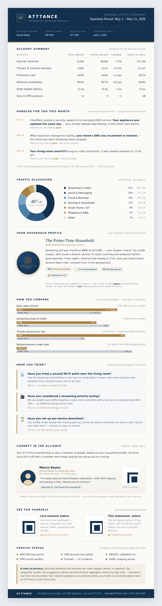
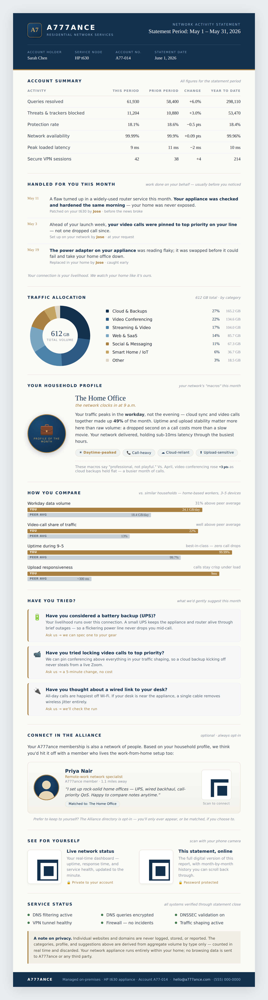
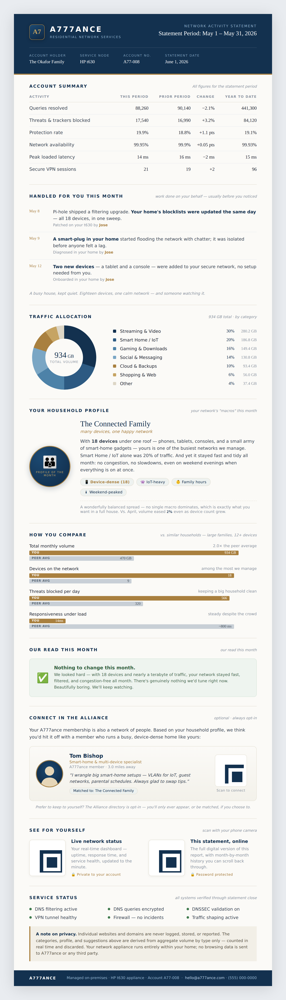
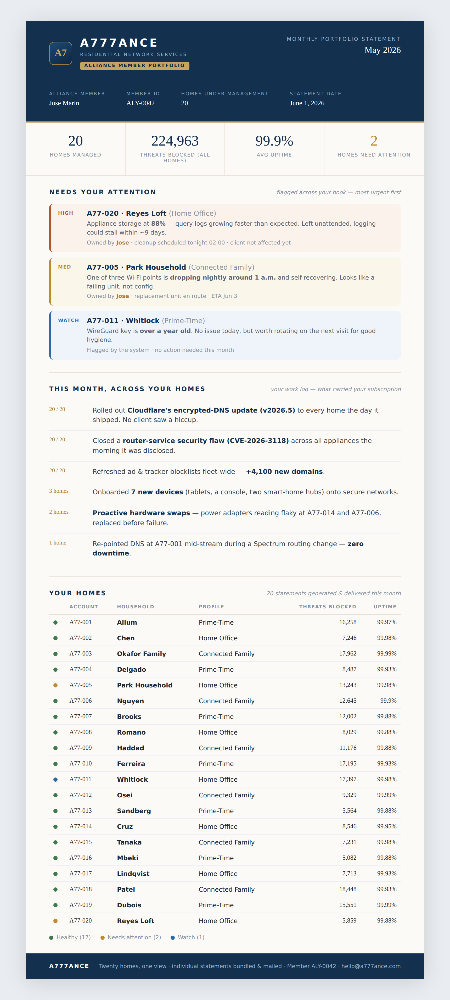

# Monthly statements

Client-facing **Network Activity Statements** plus the operator-side **Alliance Member
Portfolio** — the recurring artifacts that make the stack's invisible work visible and
justify the subscription on both sides of the equation.

The model is **pest control, not lawn care**: the value is the quiet, and the statement is
the sticker on the door that proves the work happened. Designed to be both emailed and
printed/mailed on paper, and **scrollable on a phone** when opened via the QR code.

Open any `.html` in a browser; **Print → Save as PDF** for the mailed copy. Each file is
fully self-contained — inline CSS + inline SVG QR codes, no external assets, no JavaScript.

> These are **mockups of the target output** — what the generator bots should produce. Some
> figures need a real data source first; see [Data sourcing](#data-sourcing) below.

---

## Two sides of the equation

| | Audience | Artifact |
| --- | --- | --- |
| **Client** | The homeowner | A per-household 1–2 page statement, one per month |
| **Operator** | The Alliance member who manages a book of homes | One portfolio statement over all their clients, plus the bundle of individual 1-pagers |

---

## Client statements — the archetypes

One template, populated per household. The **profile**, **macros**, **benchmark**,
**suggestions**, and **"Handled For You"** log all vary with the home — this is the range a
bot would generate.

### [`client/archetype-prime-time.html`](client/archetype-prime-time.html)
Streaming-dominant household. Three tailored suggestions.



### [`client/archetype-home-office.html`](client/archetype-home-office.html)
Work-from-home: cloud + video-conferencing macros, daytime-peaked, upload-sensitive.
Different suggestions (UPS, call-priority QoS, wired backhaul).



### [`client/archetype-connected-family.html`](client/archetype-connected-family.html)
18-device family. Demonstrates the **affirmation path** — when nothing needs changing, the
suggestions section becomes a "nothing to change this month, beautifully boring" note
instead of inventing upsells.



### What's on a client statement

- **Account Summary** — period-over-period + year-to-date, brokerage-statement style.
- **Handled For You This Month** — the personal touch. Work done on the client's behalf,
  written like **local patch notes** and attributed by name ("*Cloudflare pushed a security
  update; your appliance was patched the same day — Jose*"). Always framed as *your home*,
  *your appliance*, *your living-room TV* — specific, not generic IT-speak. This is what
  reminds the client the subscription is alive.
- **Traffic Allocation** — a donut of volume by category. Categories only, never domains.
- **Household Profile** — traffic as "macros"; the balance assigns a monthly archetype.
- **How You Compare** — benchmark against a demographic cohort.
- **Have You Tried? / Our Read** — continuous-improvement suggestions, or the affirmation.
- **Connect in the Alliance** — a profile-matched member (face + blurb + connect QR). Opt-in.
- **See For Yourself** — QR codes to the live status page and the scrollable online statement.
- **Service Status** + an aggregate-only privacy note.

---

## Operator portfolio — earning the keep

### [`operator/alliance-member-portfolio.html`](operator/alliance-member-portfolio.html)
Jose manages 20 homes. Every month he gets one view of the whole book:

- **KPIs across all homes** — total threats blocked, average uptime, count needing attention.
- **Needs Your Attention** — issues **percolated to the top** across the fleet, most urgent
  first (High / Med / Watch), each owned by name with status and ETA.
- **This Month, Across Your Homes** — the operator's work log / fleet changelog: what was
  rolled out, patched, swapped, and onboarded ("*Cloudflare v2026.5 → 20/20 homes, same day*").
  This is the record that carries the subscription.
- **Your Homes** — the full roster with health dots; the index to the bundle of 1-pagers.



---

## The generator (the bots)

The repeatable pipeline these mockups aim toward, ~$0.01/client/month:

```
Pi-hole FTL + Uptime Kuma + wg + flow accounting   →   stats.json (per home)
stats.json + template   →   Claude (Haiku) writes the profile, suggestions & "Handled" copy
                        →   rendered HTML  →  Print-to-PDF  →  email / Lob.com mail
                        →   roll all homes up  →  operator portfolio
```

[`tools/`](tools/) holds the seed generators (run with no arguments; they write into
`client/` and `operator/`):
- [`generate_client.py`](tools/generate_client.py) — the parametrized client-statement
  template + per-archetype configs (profile, suggestions, "Handled For You" log).
- [`generate_operator.py`](tools/generate_operator.py) — the fleet roll-up across the book.
- `style.css`, `avatar.svg` — shared assets the client generator inlines.

QR codes are generated with `segno` (pure Python) and inlined as SVG so every statement stays
a single self-contained file.

---

## Data sourcing

Read before shipping to a paying client. Be honest about which figures are real:

| Figure | Source | Status |
| ------ | ------ | ------ |
| Queries resolved, threats blocked, protection rate | Pi-hole FTL (`pihole-FTL.db` / FTL API) | **Real** — available today |
| Uptime, latency, VPN session count | Uptime Kuma API + `wg show` | **Real** — available today |
| "Handled For You" log | The operator's own change/ticket record | **Real** — operator-maintained |
| **Traffic volume in GB, by category** | — | **Not measured today.** Pi-hole logs DNS *lookups*, not *bytes*. The donut, profile, and benchmark need a flow-accounting layer (nftables counters / `ntopng` / `nfdump`) + a domain→category map. |
| Demographic benchmark averages | — | **Needs a real cohort dataset**, or it's fabricated. Don't print invented peer averages on a kept document. |

The examples use **sample data** for the volume-based sections. Before these go out for money,
either (a) add flow accounting to the appliance, or (b) scope the statement to what
Pi-hole + Uptime Kuma can already prove.
